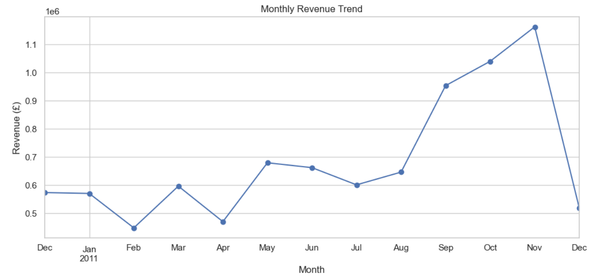
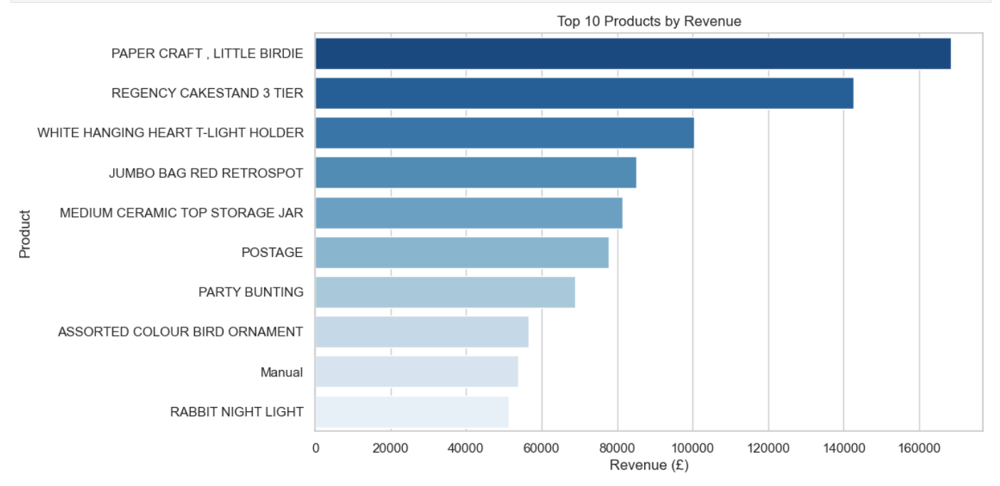

# 📊 Customer Purchasing Behavior Analysis  

## Portfolio Description:
This project analyzes the UCI Online Retail dataset to uncover customer purchasing patterns and insights. Using Python and SQL, I performed data cleaning, explored top products and customers, analyzed monthly revenue trends, and segmented customers using RFM analysis. Visualizations and actionable insights are included to support data-driven business decisions.

---

## 📌 Project Overview  
This project analyzes the **UCI Online Retail dataset** to understand **customer purchasing behavior**.  
I used **Python (Pandas, Numpy, Matplotlib, Seaborn, SQLite3)** for data cleaning, SQL queries, and visualization.  

The goals of this project are:  
- Identify top customers and products  
- Analyze monthly revenue trends  
- Segment customers using **RFM (Recency, Frequency, Monetary)** analysis  
- Generate actionable insights for business growth  

---

## 🛠️ Tools & Technologies  
- **Python**: Pandas, Numpy, Matplotlib, Seaborn, SQLite3  
- **SQL**: SQLite for queries  
- **Jupyter Notebook**: For analysis and visualization  

---

## 📁 Project Files

- `customer_purchasing_behaviour.ipynb` – Jupyter Notebook containing the full analysis and visualizations  
- `Online Retail.xlsx` – Original dataset used for analysis  
- `requirements.txt` – List of Python libraries needed to run the notebook  
- `README.md` – Project documentation (this file)  
- `images/` – Folder containing all chart images:
    - `monthly_revenue_trend.png` – Monthly revenue visualization  
    - `Top_10_by_revenue.png` – Top 10 products by revenue  
    - `Top_10_by_revenue(1).png` – Alternate version of top 10 products chart  

---

## 📊 Key Insights  
- 📈 **Monthly Revenue Trend**: Shows seasonal peaks in sales.  
- 🛒 **Top Products**: A few products contribute the majority of revenue.  
- 👥 **Top Customers**: A small group of loyal customers drive high sales.  
- 🎯 **RFM Segmentation**: Customers classified as **loyal, frequent, or high-value**.  

---

## 📷 Visualizations  

### Monthly Revenue Trend  
  

### Top 10 Products by Revenue  
  
.png)
---

## ▶️ How to Run This Project  

### 1. Clone the repository  
```bash
git clone https://github.com/harshithaadicherla10/customer-purchasing-behavior/tree/main.git
cd customer-purchasing-behavior
```
### 2. Create a virtual environment (optional)
```
python -m venv venv
venv\Scripts\activate   # Windows
source venv/bin/activate  # Mac/Linux
```
### 3. Install required libraries
```
pip install -r requirements.txt
```
### 4. Dataset
```
Download the Online Retail Dataset from UCI Repository
Save it inside the data/ folder as:
data/Online Retail.xlsx
```
### 5. Open the Notebook
```
jupyter notebook customer_purchasing_behaviour.ipynb
```

## 🚀 Future Improvements
- Perform Cohort Analysis for customer retention insights
- Build a Customer Lifetime Value (CLV) model
- Apply Machine Learning for predictive customer segmentation

## 🙋 Author
**Harshitha Adicherla**

📬 Feel free to explore, fork, or leave feedback!
